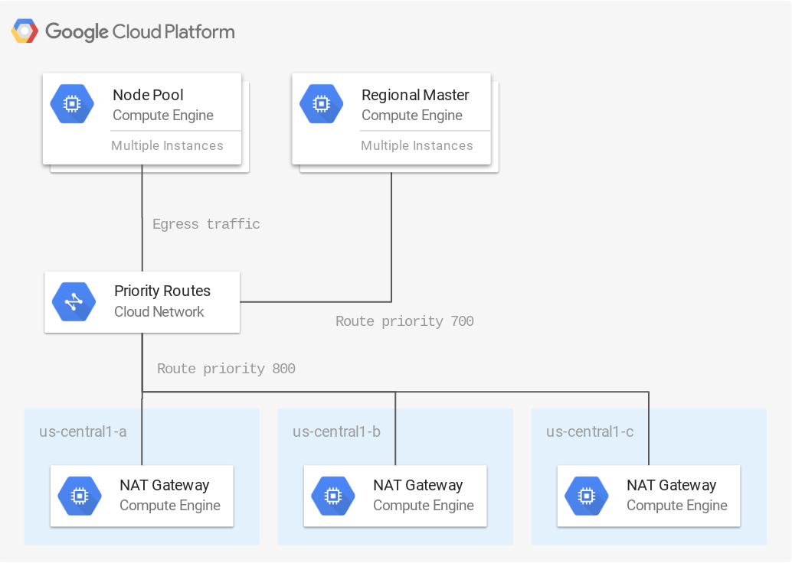

# Highly Available NAT Gateway for GKE Nodes

This example creates three NAT Gateway instances in different zones and Compute Engine Network Routes to route outbound traffic from an existing GKE cluster.

**Figure 1.** *diagram of Google Cloud resources*



## Setup Environment

```
gcloud auth application-default login
export GOOGLE_PROJECT=$(gcloud config get-value project)
```

This example assumes you have an existing Kubernetes Engine cluster.

### Get Master IP and Node Tags

Record the target cluster name, region, zone, and network:

```
CLUSTER_NAME=dev
REGION=us-central1
ZONE_1=us-central1-a
ZONE_2=us-central1-b
ZONE_3=us-central1-c
NETWORK=default
SUBNETWORK=default
```

Create a `terraform.tfvars` file with the the region, zone, master IP, and the node pool nework tag name to the tfvars file:

```
NODE_TAG=$(gcloud compute instance-templates describe $(gcloud compute instance-templates list --filter=name~gke-${CLUSTER_NAME:0:20} --limit=1 --uri) --format='get(properties.tags.items[0])')
MASTER_IP=$(gcloud compute firewall-rules describe ${NODE_TAG/-node/-ssh} --format='value(sourceRanges)')

cat > terraform.tfvars <<EOF
region = "${REGION}"
zone1   = "${ZONE_1}"
zone2   = "${ZONE_2}"
zone3   = "${ZONE_3}"
gke_master_ip = "${MASTER_IP}"
gke_node_tag = "${NODE_TAG}"
network = "${NETWORK}"
subnetwork = "${SUBNETWORK}"
EOF
```

## Run Terraform

```
terraform init
terraform plan -out terraform.tfplan
terraform apply terraform.tfplan
```

## Verify NAT Gateway Routing

Create pod and port forward to run test from:

```
kubectl run squid --port 3128 --image datadog/squid && \
  kubectl wait deploy/squid --for condition=available
kubectl port-forward deploy/squid 3128:3128 &
```

Show the external IP address that the cluster node is using by running a Kubernetes pod that uses curl:

```
curl --proxy localhost:3128 -s http://ipinfo.io/ip
```

Run the above command several more times to see it cycle between the ip addresses of each NAT gateway instance. Run the below command to see all external IPs of the NAT gateways.

```
terraform output
```

Stop the port-forward when finished:

```
killall kubectl
```

## Caveats

1. The web console SSH will no longer work, you have to jump through the NAT gateway machine to SSH into a GKE node.
2. You can use the `gcloud-ssh` helper script to jump through an arbitrary bastion host:

```
git clone https://github.com/danisla/gcloudfunc.git
echo "source ${PWD}/gcloudfunc/gcloudfunc.bash" >> ${HOME}/.bash_profile
source ${HOME}/.bash_profile

gcloud-ssh
```

## Cleanup

Remove all resources created by terraform:

```
terraform destroy
```