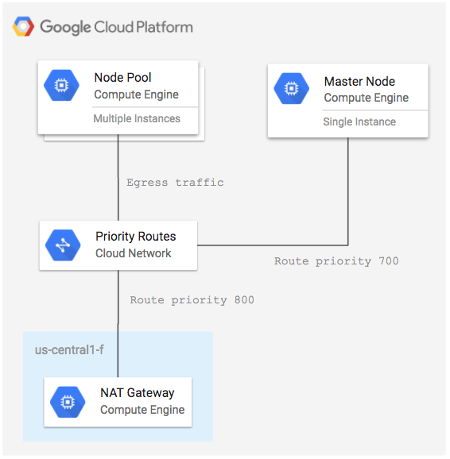

# NAT Gateway for GKE Nodes

This example creates a NAT Gateway and Compute Engine Network Routes to route outbound traffic from an existing GKE cluster through the NAT Gateway instance.

**Figure 1.** *diagram of Google Cloud resources*



> Note: This example only deploys a single-node NAT gateway instance and is not intended for production use. See the [ha-natgateway](../ha-nat-gateway) example for a highly available option.

## Setup Environment

```
gcloud auth application-default login
export GOOGLE_PROJECT=$(gcloud config get-value project)
```

This example assumes you have an existing Container Engine cluster.

### Get Master IP and Node Tags

Record the target cluster name, region and zone:

```
CLUSTER_NAME=dev
REGION=us-central1
ZONE=us-central1-b
NETWORK=default
SUBNETWORK=default
```

Create a `terraform.tfvars` file with the the region, zone, master IP, and the node pool nework tag name to the tfvars file:

```
NODE_TAG=$(gcloud compute instance-templates describe $(gcloud compute instance-templates list --filter=name~gke-${CLUSTER_NAME:0:20} --limit=1 --uri) --format='get(properties.tags.items[0])')
MASTER_IP=$(gcloud compute firewall-rules describe ${NODE_TAG/-node/-ssh} --format='value(sourceRanges)')

cat > terraform.tfvars <<EOF
region = "${REGION}"
zone   = "${ZONE}"
network = "${NETWORK}"
subnetwork = "${SUBNETWORK}"
gke_master_ip = "${MASTER_IP}"
gke_node_tag = "${NODE_TAG}"
EOF
```

## Run Terraform

```
terraform init
terraform plan
terraform apply
```

## Verify NAT Gateway Routing

Show the external IP address that the cluster node is using by running a Kubernetes pod that uses curl:

```
kubectl run example -i -t --rm --restart=Never --image centos:7 -- curl -s http://ipinfo.io/ip
```

The IP address shown in the pod output should match the value of the NAT Gateway `external_ip`. Get the external IP of the NAT Gateway by running the command below:

```
terraform output
```

## Caveats

1. The web console SSH will no longer work, you have to jump through the NAT gateway machine to SSH into a GKE node:

```
eval ssh-agent $SHELL
ssh-add ~/.ssh/google_compute_engine
CLUSTER_NAME=dev
REGION=us-central1
gcloud compute ssh $(gcloud compute instances list --filter=name~nat-gateway-${REGION} --uri) --ssh-flag="-A" -- ssh $(gcloud compute instances list --filter=name~gke-${CLUSTER_NAME}- --limit=1 --format='value(name)') -o StrictHostKeyChecking=no
```

## Cleanup

Remove all resources created by terraform:

```
terraform destroy
```