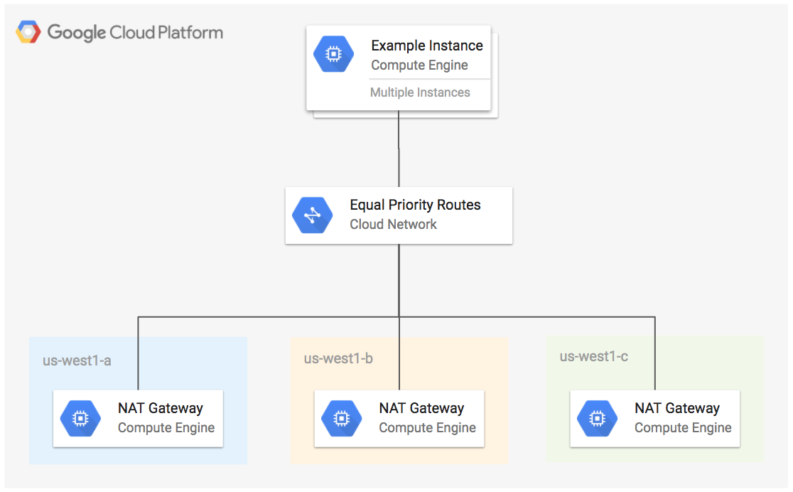

# Highly Available NAT Gateway Example

This example creates a NAT gateway in 3 Compute Engine zones within the same region. Traffic is balanced between the instances using equal cost based routing with equal route priorities to the same instance tag.

**Figure 1.** *diagram of Google Cloud resources*



## Setup Environment

```
gcloud auth application-default login
export GOOGLE_PROJECT=$(gcloud config get-value project)
```

## Run Terraform

```
terraform init
terraform plan
terraform apply
```

SSH into the instance by hopping through one of the NAT gateway instances, first make sure that SSH agent is running and your private SSH key is added to the authentication agent.

```
gcloud compute config-ssh
eval `ssh-agent $SHELL`
ssh-add ~/.ssh/google_compute_engine
BASTION=$(terraform output -module nat-zone-1 -json | jq -r '.instance.value')
REMOTE_HOST=$(terraform output -module mig1 -json | jq -r '.instances.value[0][0]')
SSH_USER=$(gcloud config get-value account)
gcloud compute ssh ${SSH_USER//@*}@${BASTION} --ssh-flag="-A" -- ssh ${REMOTE_HOST//*instances\//} -o StrictHostKeyChecking=no
```

Check the external IP of the instance:

```
curl http://ipinfo.io/ip
```

Repeat the command above a few times and notice that it cycles between the external IP of the NAT gateway instances.

## Cleanup

Remove all resources created by terraform:

```
terraform destroy
```
