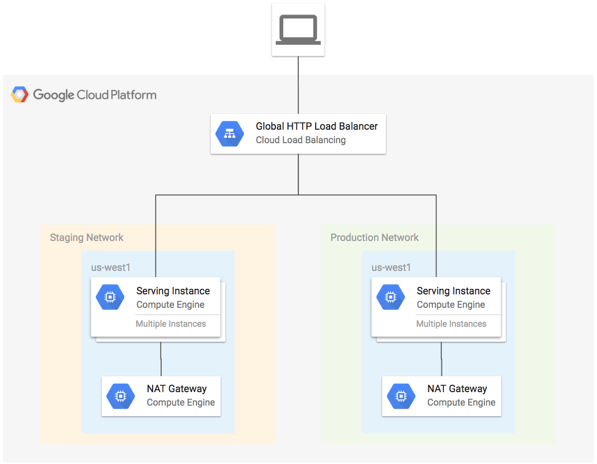

# Global HTTP Example to Multiple Networks

This example creates a global HTTP forwarding rule to instance groups in separate networks. The instances access the internet through the NAT gateway in their respective network.

**Figure 1.** *diagram of Google Cloud resources*



## Setup Environment

```
gcloud auth application-default login
export GOOGLE_PROJECT=$(gcloud config get-value project)
```

## Run Terraform

```
terraform init
terraform plan
terraform apply
```

Open URL of load balancer in browser:

```
EXTERNAL_IP=$(terraform output lb-ip)
(until curl -sf -o /dev/null http://${EXTERNAL_IP}; do echo "Waiting for Load Balancer... "; sleep 5 ; done) && \
  open http://${EXTERNAL_IP}
```

After refreshing several times, you will see the details of instances from the staging and production networks. The `External IP` field should match the external IP of the NAT gateway instnace in the respective network:

```
terraform output -module staging-nat-gateway
terraform output -module production-nat-gateway
```

## Cleanup

Remove all resources created by terraform:

```
terraform destroy
```